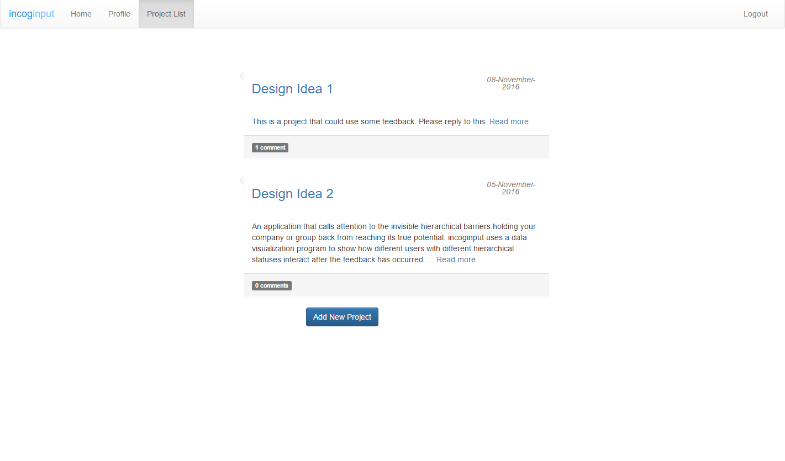
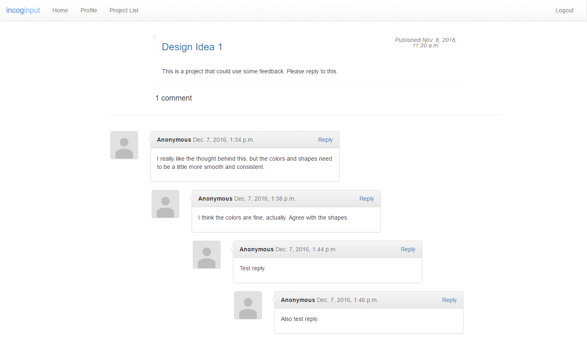

# incoginput

 incoginput, an application made for collaboration. It functions similarly to an anonymous message board, with each project serving as the topic for discussion. Each user could express their feedback with total anonymity, and users of all ranks are able to ask questions without fear of judgement. As a user, you would only be able to see your own profile with designated "rank"--everyone else is unknown to you.

 You can see if upper management makes the most number of comments, or if the middle level is not providing enough feedback, all while being anonymous. Seeing the connections and feedback roads provides data that would allow one to assess their communications and tailor the fit to what is best for them.